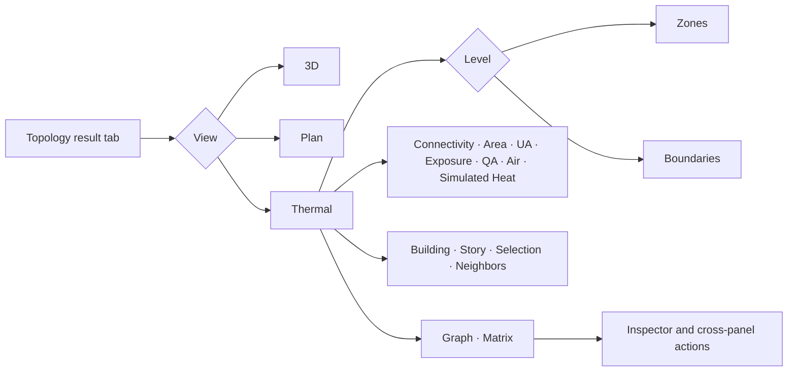

# Topology guide

The former Geometry tab is now named **Topology** because the panel answers two
different questions with one shared selection: _where is this object?_ and
_what does it connect to?_ The internal result-tab/API identifier remains
`geometry`, so existing workspaces, shortcuts, automation, and API clients keep
working.

## Current panel map



The diagram reflects the current toolbar and inspector. Advanced controls hold
the area basis, opening and air-layer toggles, external-target expansion, and
label visibility.

## View roles

### 3D

Use 3D to inspect position, orientation, envelope shape, and the spatial
relationships among zones, surfaces, and windows. Areas shown on spatial
objects are physical polygon areas.

### Plan

Use Plan to inspect one story at a time: floor-plan composition, zone
boundaries, and surface/window positions. Selecting a zone projects to the same
zone node in Thermal.

### Thermal

Use Thermal to inspect the authoritative thermal network. The compact Zones
level aggregates connections between zone/space owners and their targets. The
Boundaries level expands an edge into its source surfaces, paired interfaces,
openings, air couplings, diagnostics, and source anchors. Spatial and network
layouts are deterministic; Graph and Matrix are two projections of the same
connection records.

## Authoritative boundary versus geometric adjacency

EnergyPlus boundary fields are authoritative. `Outside Boundary Condition` and
its object resolve a surface to Outdoors, Ground, another Surface, Zone, Space,
Adiabatic, Foundation, or an OtherSide target. An explicit interzone Surface
pair is valid only when it is reciprocal and owned by different zones.

Geometric adjacency compares transformed world-space polygons. It can confirm
a declared pair or report that two polygons touch despite being adiabatic or
otherwise disconnected. It is a QA observation and never creates an
authoritative thermal relation.

## Physical and model-total area

- **Physical** is the polygon/opening area for one geometric instance.
- **Model total** (the default effective basis) multiplies physical area by the
  zone and surface/opening multipliers used by the model.
- Gross area includes openings; opaque area subtracts them. Opening area is
  available as its own component.

For a boundary, `opaque UA = opaque area × construction U-value` and each
opening contributes `opening area × opening U-value`. Total UA is reported only
when every required construction has usable thermal performance. Coverage is
shown separately so an incomplete construction set is not mistaken for a low
UA.

## Area, UA, and simulated heat

- **Area** is geometry in m² for the selected physical/model-total basis.
- **UA** is static conductance in W/K derived from constructions and area.
- **Simulated Heat** is signed EnergyPlus result energy in kWh for the selected
  period or frame. Positive enters the canonical owning zone; negative leaves
  it.

UA is not a load or an energy result. The simulated overlay has separate
controls, color/direction legend, source ledger, aggregation metadata, and
output-plan action so it cannot be read as static UA.

## Interzone interfaces and double counting

Two reciprocal surfaces form one stable thermal interface. The compact
connection counts the interface area once, retains both boundary IDs for
source navigation, and similarly canonicalizes paired interior openings.
Matrix cells and simulation flows use the same canonical side. The reverse
cell is a symmetric view, not a second quantity.

## Air coupling layer

`ZoneMixing`, `ZoneCrossMixing`, refrigeration door mixing,
`Construction:AirBoundary`, and AirflowNetwork surface paths form air-coupling
records. They retain direction, design flow, schedule, AFN surface/component,
and source anchors. Air edges are displayed separately from conductive
boundaries; ordinary zone-local infiltration does not become a zone-pair edge.

## QA observations and EnergyPlus rule issues

- **QA observations** describe geometry evidence, such as declared-and-matched
  polygons or geometrically adjacent but thermally disconnected surfaces.
- **Rule issues** identify invalid model semantics: missing/one-way/duplicate
  counterparts, mismatched construction or geometry, unresolved external
  targets, open/non-manifold enclosures, and missing air/AFN targets.

QA metric patterns distinguish observations from rule failures. A rule issue
shares its stable issue ID with Diagnose; selecting it can open the exact
Diagnose row and source field.

## Shared selection and navigation

3D, Plan, Thermal, Semantic Text, and Diagnose share one semantic selection.
Thermal inspector actions can reveal source surfaces in 3D/Plan, exact semantic
occurrences, source fields, constructions, Diagnose issues, Profile/HVAC/Output
context, the simulation purpose plan, and Heat-Flow Ledger sources. Back and
Forward restore view mode, scope, metric, graph level, pan/zoom, and stable
selection. Follow can be turned off without breaking explicit reveal actions.
Navigation changes view state only and does not request backend analysis.

Settings and Batch preserve the same document analysis key. Returning to the
app restores Thermal context from the cached topology; Batch Summary exposes
normalized topology metrics, physical/model-total basis, delta, percent, and
CSV/JSON/XLSX export.

## Keyboard workflow

When Topology is active, `1`, `2`, and `3` switch 3D, Plan, and Thermal; `F`
fits the active view; `G` switches Graph/Matrix; `T`, `A`, `U`, and `Q` choose
Connectivity, Area, UA, and QA; and `N` selects neighbor scope. Graph and Matrix
targets follow deterministic tab order and activate with Enter or Space. These
shortcuts are configurable and do not consume keys in editors.

## Canonical terms

### Thermal boundary

The authoritative relation by which one heat-transfer surface connects its
owning space or zone to a thermal target.

### Thermal interface

One interzone interface formed by two explicit surfaces with a reciprocal
relation.

### Thermal connection

An edge in the compact graph that aggregates boundaries/interfaces for the
same owner-to-target pair and relation.

### Geometric adjacency

A world-space polygon observation used only to validate modeling intent. It
never creates an authoritative thermal relation.

### Air coupling

An air-movement relation kept separate from surface conduction.

### Static UA

Static heat-transmission potential calculated from construction U-value and
area. Static UA is not energy flow, a load, or a simulation result.

### Simulated heat flow

A signed EnergyPlus result aggregated for a specific period or frame and
linked to its output sources.

## Advanced/debug information

JSON export exposes stable IDs, `sourceAnchors`, geometry checks, issue links,
construction coverage, and schema/model hashes. The CLI uses the same canonical
report:

```text
semantic-idf topology --level zone --metric ua --area-basis effective model.idf
semantic-idf topology --level boundary --metric qa --format graphml model.idf
```

See [thermal-topology-schema.md](thermal-topology-schema.md) for the report and
simulation-overlay contracts.
