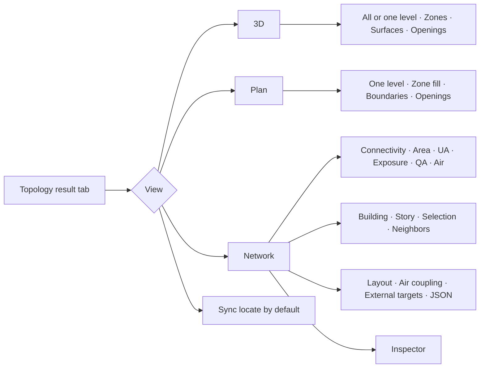

# Topology guide

The **Topology** tab answers two different questions with one shared selection:
_where is this object?_ and _what does it connect to?_ Frontend result-tab,
route, workspace, and shortcut identifiers use `topology`. Legacy saved
`geometry` view identifiers are normalized during settings migration, while the
backend payload remains available under `report.geometry` for API compatibility.

## Current panel map



The toolbar shows only options that affect the active view. 3D and Plan keep
independent visibility settings. Network shows its story selector only when
the scope is Story. Fit and Expand are icon controls inside the drawing area.

## View roles

### 3D

Use 3D to inspect position, orientation, envelope shape, and the spatial
relationships among zones, surfaces, and windows. Areas shown on spatial
objects are polygon areas. Its level selector can show all levels or one level.

### Plan

Use Plan to inspect one story at a time: floor-plan composition, zone
boundaries, and surface/window positions. Selecting a zone projects to the same
zone node in Network. Zone fill, boundaries, and openings are independent Plan
layers and do not change the 3D visibility settings.

### Network

Use Network to inspect the authoritative zone-level thermal network. It
aggregates connections between zone/space owners and their targets. Source
boundaries remain available from the inspector. Spatial and network layouts
are deterministic projections of the same connection records. Drag a zone or
environment endpoint to adjust the current layout; connected routes update in
place. Outdoor endpoints are compact directional points, while each Adiabatic
surface is a selectable detached wall stub rather than a shared environment
node.

## Authoritative boundary versus geometric adjacency

EnergyPlus boundary fields are authoritative. `Outside Boundary Condition` and
its object resolve a surface to Outdoors, Ground, another Surface, Zone, Space,
Adiabatic, Foundation, or an OtherSide target. An explicit interzone Surface
pair is valid only when it is reciprocal and owned by different zones.

Geometric adjacency compares transformed world-space polygons. It can confirm
a declared pair or report that two polygons touch despite being adiabatic or
otherwise disconnected. It is a QA observation and never creates an
authoritative thermal relation.

## Area and multiplier

- **Gross area** is the canonical polygon area and includes openings.
- **Multiplier** is reported separately so repeated model instances are not
  hidden inside the displayed area.
- Opaque and opening contributions remain available as separate inspector
  variables when they are relevant to a selected source boundary.

For a boundary, `opaque UA = opaque area × construction U-value` and each
opening contributes `opening area × opening U-value`. Total UA is reported only
when every required construction has usable thermal performance. Coverage is
shown separately so an incomplete construction set is not mistaken for a low
UA.

## Area and UA

- **Area** is canonical gross geometry in m².
- **UA** is static conductance in W/K derived from constructions and area.

UA is not a load or an energy result. Simulation results remain in the
Simulation tab and are not mixed into the static Network metrics.

## Interzone interfaces and double counting

Two reciprocal surfaces form one stable thermal interface. The compact
connection counts the interface area once, retains both boundary IDs for
source navigation, and similarly canonicalizes paired interior openings.
Network edges and simulation flows use the same canonical side, so the reverse
relation is not counted as a second quantity.

## Air coupling layer

`ZoneMixing`, `ZoneCrossMixing`, refrigeration door mixing,
`Construction:AirBoundary`, and AirflowNetwork surface paths form air-coupling
records. They retain direction, design flow, schedule, AFN surface/component,
and source anchors. Air edges are displayed separately from conductive
boundaries; ordinary zone-local infiltration does not become a zone-pair edge.

## QA observations and EnergyPlus rule issues

- **QA observations** describe geometry evidence, such as declared-and-matched
  polygons or geometrically adjacent but thermally disconnected surfaces.
- **Rule issues** identify invalid model semantics: missing/one-way/duplicate
  counterparts, mismatched construction or geometry, unresolved external
  targets, open/non-manifold enclosures, and missing air/AFN targets.

QA metric patterns distinguish observations from rule failures. Rule issue IDs
are also reported by Tools / Diagnose when it analyzes the same document
snapshot.

## Shared selection and navigation

3D, Plan, Network, and Semantic Text share one semantic selection.
Sync locate is enabled by default, so selecting a visual object also locates
its input source. Back and Forward restore view mode, scope, metric, each
spatial view's visibility, pan/zoom, and stable selection. Navigation changes
view state only and does not request backend analysis.

Settings and Tools preserve the same document snapshot key. Returning to the
app restores Network context from the cached topology; Batch Metrics exposes
normalized topology metrics, delta, percent, and CSV/JSON/XLSX export.

## Keyboard workflow

When Topology is active, `1`, `2`, and `3` switch 3D, Plan, and Network; `F`
fits the active view; `T`, `A`, `U`, and `Q` choose Connectivity, Area, UA, and
QA; and `N` selects neighbor scope. Network targets follow deterministic tab
order and activate with Enter or Space. These shortcuts are configurable and
do not consume keys in editors.

## Canonical terms

### Thermal boundary

The authoritative relation by which one heat-transfer surface connects its
owning space or zone to a thermal target.

### Thermal interface

One interzone interface formed by two explicit surfaces with a reciprocal
relation.

### Thermal connection

An edge in the compact graph that aggregates boundaries/interfaces for the
same owner-to-target pair and relation.

### Geometric adjacency

A world-space polygon observation used only to validate modeling intent. It
never creates an authoritative thermal relation.

### Air coupling

An air-movement relation kept separate from surface conduction.

### Static UA

Static heat-transmission potential calculated from construction U-value and
area. Static UA is not energy flow, a load, or a simulation result.

### Simulated heat flow

A signed EnergyPlus result aggregated for a specific period or frame and
linked to its output sources.

## Advanced/debug information

JSON export exposes stable IDs, `sourceAnchors`, geometry checks, issue links,
construction coverage, and schema/model hashes. The CLI uses the same canonical
report:

```text
semantic-idf topology --level zone --metric ua --area-basis effective model.idf
semantic-idf topology --level boundary --metric qa --format graphml model.idf
```

See [thermal-topology-schema.md](thermal-topology-schema.md) for the report and
simulation-overlay contracts.
